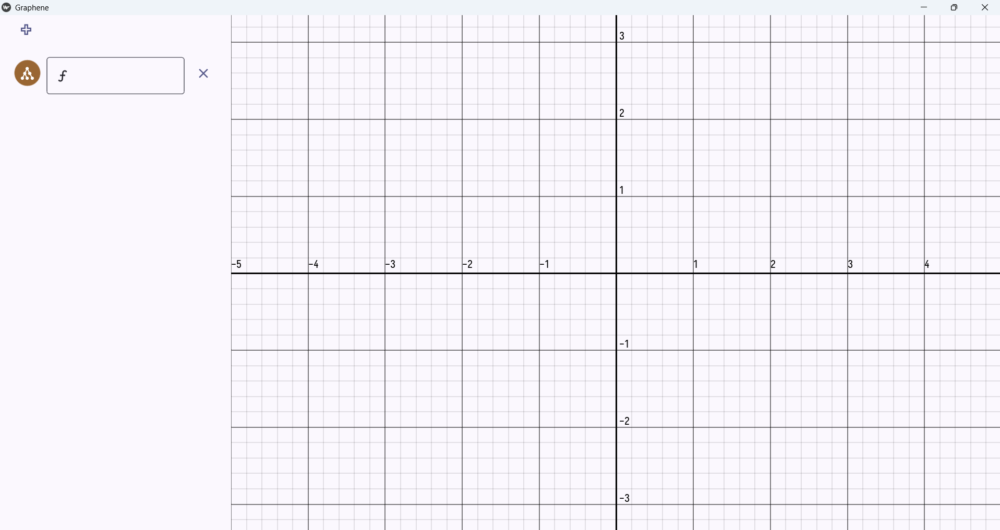
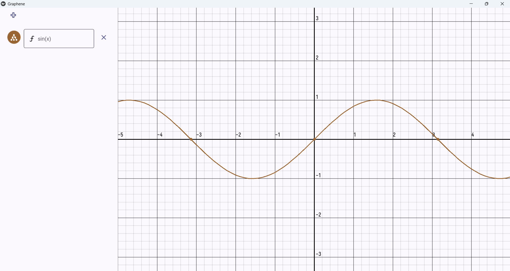
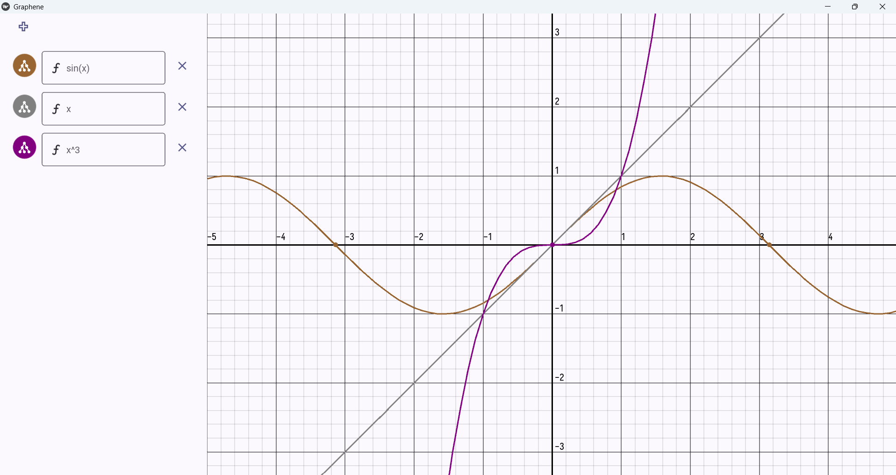
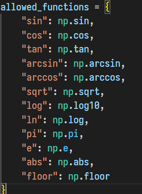

# Graphene

An attempt at a Desmos "inspired" amateur graphing calculator made using Kivy.

## Images





## How to Run

### Prerequisites

- Python: Any `python` version above python `3.11` would be preferred 
- Pip: `Pip` is needed to handle and install kivy's dependencies
- Graphics: Need a GPU with atleast `OpenGL (ES) 2.0+` drives to render the UI. For `Non GPU` users you can use the `ANGLE` backend for Windows or the `Mesa 3D` for Linux 

[!WARNING]
It is recommended to run the program on Windows over Linux as some features such as panning and zooming may not work as intended. 


### How to Run

1 **Running main.py:**
- Clone the project into your machine and enter the directory 

    ```bash
      git clone https://github.com/Debag101/Graphene.git
      cd Graphene
    ```

- Install dependencies 

    ```bash 
     pip install https://github.com/kivymd/KivyMD/archive/master.zip
     pip install -r requirements.txt
    ```

- Run main.py

    ```bash
    python src/main.py
    ```

2 **Running the exe:**

[!WARNING]
It is recommended to use method 1, compiling it directly on your machine as the exe may or may not work as intended. 

- Navigate to the releases page
- Install Graphene.exe
- Run the executable

### How to use

- I advise you to run the app in fullscreen as it may cause problems in the textboxes. 
- 
- Above is the list of allowed functions, refer to the key values to the left. 
- Write the name of the function followed by a parentheses and pass the argument which must be `x` to use the function
- For example `sin(x) + 5 * log(x)` is a valid syntax
- Carat `^` can be used to raise to power, like `x^3`
- To add more textboxes click the `+` button on the top left and to delete a graph box, click the `cross` or `x` button to its right.
- The extent of my graphing calculator is very primitive and it won't support a lot of functionalities, I tried writing to the best of my abilites, hope you liked it.

## Components

This project was entirely made using the `Kivy` GUI library and its fork `KivyMD` in python and kivy's native design language kvlang.

